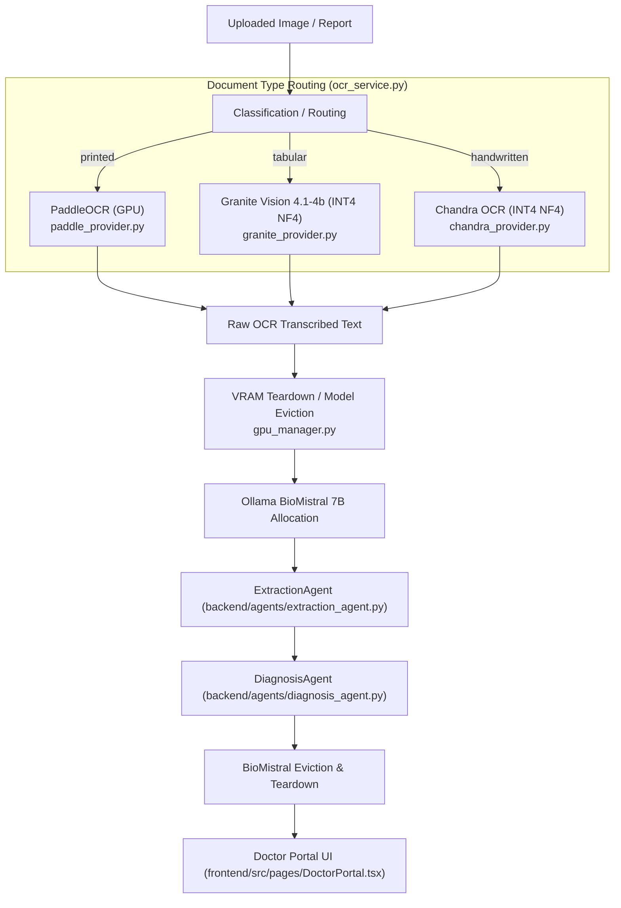

# MedVault OCR & AI Pipeline — Technical Architecture & Reference Guide (`demo.md`)

This document provides a comprehensive technical reference for the MedVault hybrid OCR and BioMistral 7B AI evaluation pipeline. It details document routing logic, VRAM lifecycle management on 8GB GPUs, file paths, function signatures, database schemas, and frontend rendering components.

---

## 1. System Overview & Architecture

The MedVault pipeline processes medical documents (printed lab reports, tabular panels, and handwritten clinical notes) through specialized OCR vision models, followed by a clinical evaluation narrative powered by **BioMistral 7B GGUF (4-bit)** via Ollama.



---

## 2. Document Type Routing Matrix

| Document Category | Primary OCR Engine | Quantization / Runtime | Provider File Path | Core Function / Class |
| :--- | :--- | :--- | :--- | :--- |
| **`printed`** | PaddleOCR | FP16 (GPU / CUDA) | [paddle_provider.py](file:///c:/Users/oliad/Desktop/pipeline_tablehandwritten/pipeline_v1/backend/ocr/providers/paddle_provider.py) | `PaddleOCRProvider.extract_text()` |
| **`tabular`** | IBM Granite Vision 4.1-4b | INT4 NF4 (`bitsandbytes`) | [granite_provider.py](file:///c:/Users/oliad/Desktop/pipeline_tablehandwritten/pipeline_v1/backend/ocr/providers/granite_provider.py) | `GraniteVisionProvider.extract_text()` |
| **`handwritten`** | Chandra OCR (`chandra-ocr-2`) | INT4 NF4 (`bitsandbytes`) | [chandra_provider.py](file:///c:/Users/oliad/Desktop/pipeline_tablehandwritten/pipeline_v1/backend/ocr/providers/chandra_provider.py) | `ChandraOCRProvider.extract_text()` |

### Router Dispatcher
- **File Path**: [ocr_service.py](file:///c:/Users/oliad/Desktop/pipeline_tablehandwritten/pipeline_v1/backend/services/ocr_service.py)
- **Class**: `AutoOCRProvider`
- **Method**: `extract_text(filepath, filetype, doc_type_hint="")`
- **Logic**: Inspects `doc_type_hint` or invokes internal classifier to route to `PaddleOCRProvider`, `GraniteVisionProvider`, or `ChandraOCRProvider`.

---

## 3. VRAM Lifecycle & Eviction Management (8GB VRAM Constraint)

To run multiple heavy vision models and a 7B LLM on an 8GB GPU (NVIDIA RTX 5060 Laptop GPU) without CUDA Out-Of-Memory (OOM) crashes, the pipeline enforces strict sequential loading and model eviction:

### VRAM Eviction Controller
- **File Path**: [gpu_manager.py](file:///c:/Users/oliad/Desktop/pipeline_tablehandwritten/pipeline_v1/backend/gpu_manager.py)

#### Key Eviction Functions:
1. `evict_chandra()`:
   - Unloads Chandra Vision PyTorch model from GPU memory, forces `gc.collect()` and calls `torch.cuda.empty_cache()`.
2. `evict_ollama(base_url, model)`:
   - Issues a zero-keepalive HTTP POST to Ollama (`/api/generate` with `"keep_alive": 0`) to immediately drop BioMistral 7B from GPU VRAM after inference.
3. `ping_ollama(base_url)`:
   - Verifies if the local Ollama server is running on port 11434 before triggering LLM calls.

---

## 4. End-to-End Execution Flow & Services

### Step 1: Automatic Background Task on Upload
- **File Path**: [pipeline_service.py](file:///c:/Users/oliad/Desktop/pipeline_tablehandwritten/pipeline_v1/backend/services/pipeline_service.py)
- **Function**: `process_report_automatic(report_id, max_retries=3, doc_type_hint="")`
- **Description**: Spawns a background thread immediately upon report upload. Runs OCR via `AutoOCRProvider`, updates SQLite `reports` table with status (`processing` -> `done`), raw `ocr_text`, standard engine title, and execution duration.

### Step 2: Unified Pipeline Run
- **File Path**: [pipeline_service.py](file:///c:/Users/oliad/Desktop/pipeline_tablehandwritten/pipeline_v1/backend/services/pipeline_service.py)
- **Function**: `run_pipeline(content, evaluate=False, summary=False, use_graph=True, report_id=None, doc_type_hint="", llm_client=None, diagnosis_client=None)`
- **Output**: Returns a `PipelineResult` payload containing:
  - `ocr.raw_output`: Raw transcribed OCR text
  - `ocr.engine`: Friendly engine title (e.g., `PaddleOCR (GPU)`, `Granite Vision 4.1-4b (GPU)`, `Chandra OCR (INT4 NF4)`)
  - `ocr.processing_time_seconds`: OCR processing duration
  - `diagnosis`: Diagnostic dictionary containing `summary_for_doctor`, `clinical_patterns`, `urgent_flags`, and `suggested_followup`
  - `metadata.duration_seconds`: Start-to-end total execution duration in seconds

### Step 3: Agentic Processing & LLM Inference
- **Extraction Agent**: [extraction_agent.py](file:///c:/Users/oliad/Desktop/pipeline_tablehandwritten/pipeline_v1/backend/agents/extraction_agent.py) (`ExtractionAgent.run(ocr_result)`) parses structured test rows.
- **Diagnosis Agent**: [diagnosis_agent.py](file:///c:/Users/oliad/Desktop/pipeline_tablehandwritten/pipeline_v1/backend/agents/diagnosis_agent.py) (`DiagnosisAgent.run(lab_report)`) passes extracted data to BioMistral 7B for clinical assessment.
- **LLM Client**: [llm_client.py](file:///c:/Users/oliad/Desktop/pipeline_tablehandwritten/pipeline_v1/backend/services/llm_client.py) (`OllamaLLMClient.complete(prompt)`) interfaces with BioMistral 7B.

---

## 5. Database Schema & REST Endpoints

### SQLite Database Schema
- **File Path**: [database.py](file:///c:/Users/oliad/Desktop/pipeline_tablehandwritten/pipeline_v1/backend/database.py)
- **Table**: `reports`
- **Key Columns**:
  - `id` (TEXT, PRIMARY KEY): Report UUID
  - `patient_id` (TEXT): Patient UUID
  - `filename` (TEXT): Original file name
  - `filepath` (TEXT): Absolute disk path to stored file
  - `doc_type` (TEXT): Category (`printed`, `tabular`, `handwritten`)
  - `ocr_text` (TEXT): Raw OCR output text
  - `ocr_engine` (TEXT): Standardized engine name
  - `duration` (REAL): OCR processing duration in seconds
  - `analysis` (TEXT): General AI analysis narrative
  - `llm_analysis` (TEXT): BioMistral 7B clinical summary narrative
  - `llm_duration` (REAL): LLM inference duration in seconds
  - `status` (TEXT): Processing status (`processing`, `done`, `failed`)

### Primary API Endpoints
- **Upload Report**: `POST /api/patient/upload` or `POST /api/test/upload` ([reports_routes.py](file:///c:/Users/oliad/Desktop/pipeline_tablehandwritten/pipeline_v1/backend/routes/reports_routes.py))
- **Run Pipeline**: `POST /api/pipeline/run` ([pipeline_routes.py](file:///c:/Users/oliad/Desktop/pipeline_tablehandwritten/pipeline_v1/backend/routes/pipeline_routes.py))
- **Pipeline Status Polling**: `GET /api/pipeline/run/status/{job_id}` ([pipeline_routes.py](file:///c:/Users/oliad/Desktop/pipeline_tablehandwritten/pipeline_v1/backend/routes/pipeline_routes.py))

---

## 6. Frontend UI Accordion & Metrics Display

### Doctor Portal UI Component
- **File Path**: [DoctorPortal.tsx](file:///c:/Users/oliad/Desktop/pipeline_tablehandwritten/pipeline_v1/frontend/src/pages/DoctorPortal.tsx)
- **Component**: `PipelineAccordion({ result })`

```tsx
// Displays Top Metrics Banner
<div className="metrics-header-bar">
  <div>🚀 OCR Engine: {result.ocr?.engine}</div>
  <div>⏱️ Total Duration: {result.metadata?.duration_seconds}s</div>
</div>

// Panel 1: Raw Transcribed Text from Paddle / Granite / Chandra
<details className="acc-panel" open>
  <summary>1 Raw OCR Text</summary>
  <pre className="ocr-text-output">{ocrText}</pre>
</details>

// Panel 2: BioMistral 7B Clinical Analysis & Diagnosis Summary
<details className="acc-panel" open>
  <summary>2 AI Diagnosis Summary (BioMistral 7B Analysis)</summary>
  <p className="dx-summary">{summaryText}</p>
</details>
```

### Theme & Styling Rules
- **File Path**: [styles.css](file:///c:/Users/oliad/Desktop/pipeline_tablehandwritten/pipeline_v1/frontend/src/styles.css)
- **Classes**: `.metrics-header-bar`, `.ocr-text-output`, `.dx-summary`
- **Dark Mode**: Configured via CSS variables (`var(--bg-alt)`, `var(--text)`, `var(--accent)`). Hardcoded hex color values are omitted to ensure 100% legibility in both Dark and Light themes.
